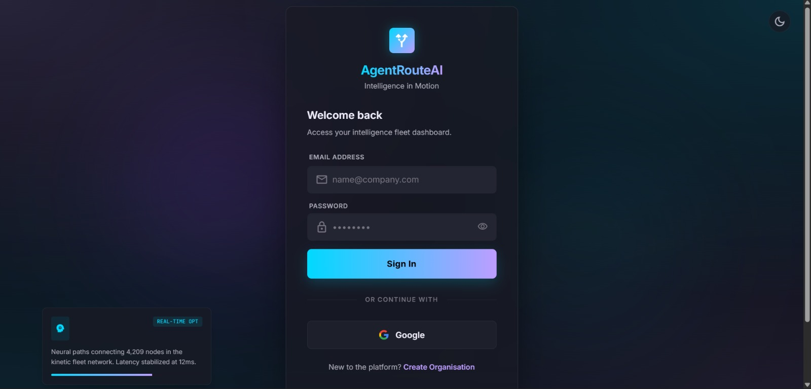
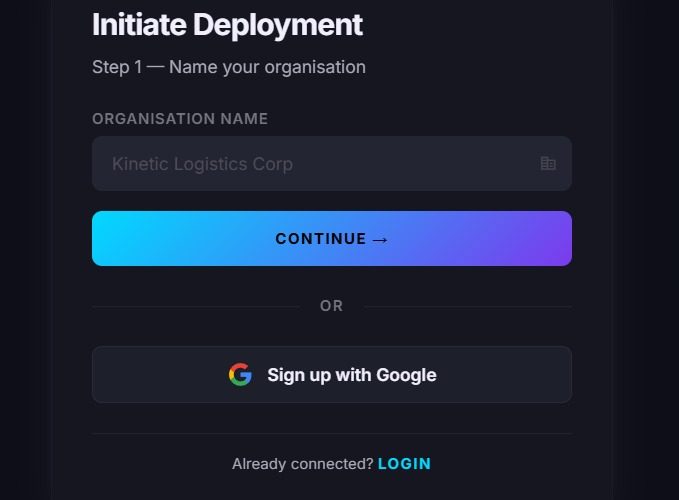

<div align="center">

# 🚀 AgentRouteAI

### Predictive Delay & Risk Intelligence for Global Supply Chains

**A multi-agent AI system that predicts shipment delays and recommends proactive mitigation — in seconds, not hours.**


</div>

---

## 📖 Table of Contents

1. [Overview](#-overview)
2. [The Problem](#-the-problem)
3. [The Solution](#-the-solution)
4. [Application Screenshots](#-application-screenshots)
5. [System Architecture](#-system-architecture)
6. [Key Features](#-key-features)
7. [Technology Stack](#-technology-stack)
8. [Quick Start Guide](#-quick-start-guide)
9. [Environment Configuration](#-environment-configuration)
10. [API Reference](#-api-reference)
11. [Agent Capabilities](#-agent-capabilities)
12. [Example Usage](#-example-usage)
13. [Project Structure](#-project-structure)
14. [Database Schema](#-database-schema)
15. [Security & PII Encryption](#-security--pii-encryption)
16. [Testing](#-testing)
17. [Roadmap](#-roadmap)
18. [Contributing](#-contributing)
19. [License](#-license)

---

## 🎯 Overview

**AgentRouteAI** is a production-ready, multi-agent AI system built for the *Predictive Delay and Risk Intelligence Agent* track. It transforms plain-language shipment queries into comprehensive, calibrated risk assessments with actionable mitigation strategies — all streamed live to your browser via Server-Sent Events.

The system combines **eight specialized AI agents**, a **Groq-powered LLM router**, and **real-time data from five external sources** to deliver risk intelligence that was previously only possible through hours of manual correlation across disconnected dashboards.

> **Input:** *"Shipment arriving at Jebel Ali in 3 days — identify risks"*
>
> **Output in 8 seconds:** Risk score, delay probability, prioritized risk factors, and context-specific mitigation strategies — each decision explained in plain language, with full agent reasoning traces.

---

## 🔥 The Problem

Global supply chains lose **billions of dollars annually** to unplanned shipment delays. Yet logistics teams today still **react** to disruptions after they occur:

- 🚢 A vessel already stuck at a congested port
- 🌪️ A storm already battering a trade route
- ⚠️ A geopolitical event already blocking a critical chokepoint

### Why This Happens

Existing tools are **fundamentally siloed**:

- Weather apps don't know your cargo type or value
- Port dashboards ignore geopolitical context
- Historical delay data sits unused in databases
- News monitoring requires manual keyword searches
- Vessel tracking platforms don't connect to risk models

Logistics managers are forced to manually correlate information across **five or more platforms**, making judgment calls under time pressure with incomplete information. By the time a delay is detected, the window for proactive mitigation has already closed.

**The core problem:** There is no unified, intelligent system that continuously monitors weather, news, vessel positions, port congestion, geopolitical risk, and historical patterns — and synthesizes them into a single, actionable risk score *before* the delay occurs.

---

## 💡 The Solution

AgentRouteAI is a **genuinely agentic system** — not a scripted pipeline with an LLM bolted on. The difference is architectural:

| Traditional Pipeline | AgentRouteAI |
|---|---|
| Fixed sequence of API calls | LLM router dynamically selects relevant agents |
| All agents always execute | Context-aware skipping (40% latency reduction) |
| Independent outputs averaged | Cross-validation detects and resolves conflicts |
| Static risk score | Sigmoid-calibrated probability with explanation |
| No memory or learning | Institutional recall across past analyses |
| Opaque "black box" output | Every reasoning step streamed live to UI |

### How It Works in Practice

1. **Parse** — Natural language query is decomposed into structured shipment data (port, ETA, cargo, origin, vessel)
2. **Route** — Groq LLM evaluates the query context and decides which of seven specialized agents to invoke
3. **Execute** — Relevant agents run in parallel via `ThreadPoolExecutor`, with automatic retry and graceful degradation
4. **Validate** — `SignalValidator` cross-checks agent outputs, detecting when they disagree
5. **Resolve** — `ConflictResolver` reasons about which signal to trust (e.g., short ETA → prioritize real-time weather; long ETA → weight historical patterns)
6. **Synthesize** — A single batched Groq LLM call fuses all signals into a calibrated risk assessment
7. **Mitigate** — Context-specific mitigation strategies are generated (not generic advice)
8. **Remember** — The analysis is stored for future recall and accuracy tracking
9. **Stream** — Every decision is pushed live to the UI via Server-Sent Events

---

## 📸 Application Screenshots

### 🔐 Secure Authentication

Enterprise-grade login page featuring Google SSO integration, encrypted credential handling, and a real-time system status indicator showing active neural paths and network latency. The minimalist dark UI emphasizes trust and operational focus.


---

### 📝 Two-Step Organization Onboarding

A streamlined multi-tenant registration flow designed for enterprise clients. Step 1 provisions the organization; Step 2 creates the admin account with password strength validation.

#### Step 1 — Organization Setup


#### Step 2 — Admin Account Creation


---

### 📊 Command Dashboard

The unified intelligence dashboard provides a comprehensive overview of the logistics fleet. Features include:

- **Welcome banner** with personalized greeting and agent pipeline status
- **Key metrics cards** — total analyses, organization info, role, and active agent count
- **Launch Analysis CTA** — one-click access to the 8-agent AI pipeline
- **Recent Analyses panel** — quick access to past risk assessments
- **Cross-Organization Intelligence** — request access to analyses from partner organizations
- **Quick Launch sidebar** — pre-configured routes for instant analysis (Delhi → Kerala, Mumbai → Bangalore, Shanghai → Rotterdam)
- **Sidebar navigation** — Fleet, Intelligence, Routes, Archive, and Deploy Agent


---

### 🗺️ Live Multi-Modal Analysis View

The core intelligence interface where shipment queries are analyzed in real time. Features include:

- **Transport mode selector** — Road, Maritime, and Air options with mode-aware cost models
- **Natural language query input** — submit shipments in plain English
- **Agent pipeline visualization** — 8 agent nodes (Intake, Router, Weather, News, History, Vehicle, Intel, Brain) with live progress indicators
- **Interactive Leaflet map** — real route geometry with origin/destination markers and waypoints
- **Live Agent Reasoning panel** — SSE-streamed thinking process from each agent
- **Recent Analyses & Partner Orgs** — institutional memory at a glance
- **Quick examples** — one-click demo queries for Delhi → Kerala and Shanghai → Rotterdam


---

### 📡 System Logs & Observability

Production-grade observability console providing full visibility into the AI pipeline. The observability stack includes:

- **Loki + Grafana** — Centralized log aggregation and dashboarding for all agent nodes
- **Prometheus** — Time-series metrics pipeline from every service with Grafana visualization
- **ELK Stack** — Fluentd/Bit → Elasticsearch → Kibana for full-text log search and analytics
- **Distributed Request Tracing** — Correlation IDs across backend and worker (async) jobs
- **Session-level log table** — timestamp, agent node, session ID, status, and query/route details
- **Intelligence Stream Architecture** — view of backend services and async workers
- **Live Feed** — real-time updates on active analysis sessions


---

## 🏗️ System Architecture

```
                        ┌─── Natural Language Query ────┐
                        │ "Shipment to Jebel Ali 3 days"│
                        └───────────────┬───────────────┘
                                        │
                                  ┌─────▼─────┐
                                  │  Intake   │  Regex + keyword parsing
                                  │   Agent   │  → structured shipment data
                                  └─────┬─────┘
                                        │
                                  ┌─────▼─────┐
                                  │  Agentic  │  Groq LLM decides which
                                  │  Router   │  agents are relevant
                                  └─────┬─────┘
                                        │
                ┌───────────────────────┼───────────────────────┐
                │         Parallel Agent Execution              │
                │                                               │
                │  ┌────────┐  ┌────────┐  ┌──────────────┐    │
                │  │Weather │  │  News  │  │  Historical  │    │
                │  └────────┘  └────────┘  └──────────────┘    │
                │  ┌────────┐  ┌────────┐  ┌──────────────┐    │
                │  │ Vessel │  │  Port  │  │ Geopolitical │    │
                │  └────────┘  └────────┘  └──────────────┘    │
                │              ┌────────┐                       │
                │              │ Memory │                       │
                │              └────────┘                       │
                └───────────────────────┬───────────────────────┘
                                        │
                              ┌─────────▼─────────┐
                              │ Signal Validator  │  Detects conflicts
                              │ Conflict Resolver │  Reasons about trust
                              └─────────┬─────────┘
                                        │
                              ┌─────────▼─────────┐
                              │    Risk Agent     │  ONE batched Groq
                              │   (Synthesizer)   │  LLM call
                              └─────────┬─────────┘
                                        │
                              ┌─────────▼─────────┐
                              │    Mitigation     │  Context-specific
                              │    Strategist     │  strategies
                              └─────────┬─────────┘
                                        │
                              ┌─────────▼─────────┐
                              │ Confidence Scorer │  Multi-dimensional
                              │  + Memory Store   │  quality score
                              └─────────┬─────────┘
                                        │
                                        ▼
                   Risk Score + Factors + Mitigation
                   streamed live to UI via SSE
```

### What Makes This Genuinely Agentic

| Capability | Implementation Detail |
|---|---|
| **LLM-based routing** | Groq LLM evaluates query context and dynamically selects relevant agents |
| **Context-aware skipping** | Domestic road route → skips vessel, port, and geopolitical agents automatically |
| **Parallel execution** | Independent agents run concurrently via `ThreadPoolExecutor` |
| **Retry with backoff** | Failed agents retried up to 2× before graceful degradation |
| **Signal cross-validation** | `SignalValidator` detects disagreements across agent outputs |
| **Conflict resolution** | `ConflictResolver` reasons contextually about which signal to trust |
| **Confidence scoring** | Multi-dimensional quality score flags low-confidence results for human review |
| **Persistent memory** | Past analyses recalled; prediction accuracy tracked over time |
| **Live SSE streaming** | Every agent decision streamed to the UI in real time |

---

## ✨ Key Features

### 🎯 Calibrated Risk Intelligence

- **Composite Risk Score** (0–100) with clearly defined thresholds
- **Delay Probability** sigmoid-calibrated from empirical logistics data
- **Risk Level** classification: LOW / MODERATE / HIGH / CRITICAL
- **Plain-language explanations** with references to actual data points
- **Trade-off analysis** covering cost, time, and safety dimensions

### 🧠 Multi-Agent Reasoning

- **Seven specialized agents** covering weather, news, history, vessels, ports, geopolitics, and institutional memory
- **Automatic cross-validation** detects when agents provide conflicting signals
- **Contextual conflict resolution** — short ETA prioritizes real-time weather; long ETA weighs historical patterns more heavily
- **Dynamic weight adjustment** (1.3x / 0.7x) based on ETA context

### 🛡️ Enterprise-Grade Security

- **Password hashing** with bcrypt (12 rounds, 2^12 iterations)
- **PII encryption** at rest using Fernet (AES-128-CBC with HMAC-SHA256)
- **SHA-256 blind indexing** for searchable email lookup without plaintext storage
- **JWT authentication** with HttpOnly, Secure, SameSite=Strict cookies
- **Refresh token rotation** on every use with hashed server-side storage
- **Multi-tenant isolation** via organization-scoped data access
- **Email-based MFA** with 5-minute OTP TTL (configurable)
- **Role-based access control** via `@login_required` and `@admin_required` decorators

### 📡 Real-Time Transparency

- **Server-Sent Events (SSE)** stream every agent's reasoning live to the browser
- **Full audit trail** of all decisions persisted in the `agent_logs` table
- **Prediction accuracy tracking** via closed-loop outcome feedback
- **Session-level replay** of completed analyses

### 🗺️ Multi-Modal Routing

- **Road:** OSRM integration for real highway geometry, checkpoint detection, and alternate corridors
- **Maritime:** Sea lane computation with chokepoint detection (Suez, Malacca, Hormuz, Bab-el-Mandeb, Panama)
- **Air:** Great-circle estimation with hub-based connecting alternatives
- **Mode-aware cost models** — prevents absurd outputs like "$300K delay cost for a truck route"

### 📊 Production Observability

- **Loki + Grafana** for centralized log aggregation and visualization
- **Prometheus** metrics pipeline for all services and agents
- **ELK Stack** for full-text log search and Kibana analytics
- **Distributed tracing** with correlation IDs across backend and worker services
- **Health check endpoints** for Kubernetes-style liveness probes

### 🧠 Institutional Memory

- **Route-level recall** — past analyses for the same port/cargo combination
- **Accuracy scoring** — tracks prediction vs. actual outcomes over time
- **Pattern learning** — baseline risk scores per cargo type and port
- **Outcome feedback loop** — closed-loop model improvement

---

## 🛠️ Technology Stack

### Backend Infrastructure

| Component | Technology | Purpose |
|---|---|---|
| Web Framework | Flask 3.x (Python 3.12+) | Lightweight, SSE-native, rapid iteration |
| LLM Inference | Groq API (`llama-3.1-8b-instant`) | Sub-2s synthesis at ~300 tok/s |
| Database | MySQL 8.0 | ACID-compliant persistence |
| Real-Time Streaming | Server-Sent Events | Live agent reasoning to UI |
| Application Server | Gunicorn (1 worker, 8 threads) | SSE-compatible serving |
| Containerization | Docker + Docker Compose | Consistent deployment |

### External Data Sources

| Source | Purpose | Tier |
|---|---|---|
| **OpenWeatherMap** | Live weather at destination ports | Free (1,000 calls/day) |
| **Tavily Search** | Real-time shipping disruption news | Free tier |
| **AISStream** | Live vessel AIS position tracking | Free tier (WebSocket) |
| **OSRM** | Real road routing and ETAs | Open Source |
| **Internal Historical DB** | Seeded delay pattern data | Internal MySQL |

### Security Stack

| Feature | Implementation |
|---|---|
| Password Hashing | bcrypt with 12 rounds |
| PII Encryption | Fernet (AES-128-CBC + HMAC-SHA256) |
| Email Lookup | SHA-256 blind index |
| Session Tokens | JWT (15-min access + 7-day refresh) |
| Cookie Security | HttpOnly, Secure, SameSite=Strict |
| MFA | Email-based OTP (5-min TTL) |

### Frontend

| Component | Technology |
|---|---|
| Templates | Jinja2 (server-rendered HTML) |
| Styling | Custom CSS (dark theme, glassmorphic, responsive) |
| Real-Time Updates | JavaScript `EventSource` API (SSE consumer) |
| Maps | Leaflet.js + OpenStreetMap |
| Visualizations | Inline JavaScript for risk gauges and charts |

### Observability

| Component | Purpose |
|---|---|
| **Loki + Grafana** | Centralized log aggregation and dashboards |
| **Prometheus** | Time-series metrics from all services |
| **ELK Stack** | Fluentd/Bit → Elasticsearch → Kibana |
| **Distributed Tracing** | Correlation IDs across services |

---

## 🚀 Quick Start Guide

### Prerequisites

- **Python 3.12+**
- **MySQL 8.0+** (or use Docker Compose — recommended)
- **Groq API Key** — free tier available at [console.groq.com](https://console.groq.com)

### Option A: Docker Compose (Recommended)

The fastest path to a running system. Docker Compose starts MySQL and the Flask app together.

```bash
# 1. Clone the repository
git clone https://github.com/your-username/agentroute-ai.git
cd agentroute-ai

# 2. Configure environment variables
cp .env.example .env
# Edit .env and add your GROQ_API_KEY and MYSQL_PASSWORD

# 3. Build and start all services
docker compose up --build

# 4. Access the application
# Open http://localhost:5000 in your browser
```

The database schema auto-initializes on first run. Historical seed data is loaded automatically.

### Option B: Local Development

For local development with hot-reload support.

```bash
# 1. Create and activate a virtual environment
python -m venv venv
source venv/bin/activate          # macOS/Linux
venv\Scripts\activate             # Windows

# 2. Install Python dependencies
pip install -r requirements.txt

# 3. Configure environment
cp .env.example .env
# Edit .env with your API keys and local MySQL credentials

# 4. Initialize the database
python fix_db.py                  # Creates the 12-table schema
python seed_data.py               # Seeds historical shipment data

# 5. Launch the application
python run.py

# App runs at http://localhost:5000
```

---

## 🔑 Environment Configuration

Create a `.env` file in the project root with the following variables:

```env
# ═══════════════════════════════════════════════════════
# REQUIRED
# ═══════════════════════════════════════════════════════
GROQ_API_KEY=gsk_...                     # https://console.groq.com
MYSQL_PASSWORD=your_secure_password

# ═══════════════════════════════════════════════════════
# RECOMMENDED (all free tiers)
# ═══════════════════════════════════════════════════════
OPENWEATHER_API_KEY=your_key             # https://openweathermap.org/api
TAVILY_API_KEY=your_key                  # https://tavily.com
AISSTREAM_API_KEY=your_key               # https://aisstream.io

# ═══════════════════════════════════════════════════════
# SECURITY (generate before deploying)
# ═══════════════════════════════════════════════════════
FERNET_KEY=<generate: Fernet.generate_key()>
JWT_SECRET=<generate: secrets.token_hex(32)>
FLASK_SECRET_KEY=<random 32+ char string>

# ═══════════════════════════════════════════════════════
# DATABASE (optional — defaults shown)
# ═══════════════════════════════════════════════════════
MYSQL_HOST=localhost
MYSQL_PORT=3306
MYSQL_USER=root
MYSQL_DATABASE=agentroute

# ═══════════════════════════════════════════════════════
# APPLICATION (optional)
# ═══════════════════════════════════════════════════════
FLASK_ENV=development
LOG_LEVEL=INFO
```

> 💡 **Graceful Degradation:** The system works even without the external API keys. It falls back to rule-based scoring using historical data and seeded patterns. Only `GROQ_API_KEY` meaningfully improves output quality.

### Generating Security Keys

```python
# Python one-liners to generate required keys

# FERNET_KEY
from cryptography.fernet import Fernet
print(Fernet.generate_key().decode())

# JWT_SECRET
import secrets
print(secrets.token_hex(32))

# FLASK_SECRET_KEY
import secrets
print(secrets.token_urlsafe(32))
```

---

## 📡 API Reference

### Core Analysis Endpoints

| Method | Endpoint | Description |
|---|---|---|
| `POST` | `/api/analyze` | Submit a shipment query; returns `session_id` immediately |
| `GET` | `/api/stream/<session_id>` | SSE stream of live agent reasoning |
| `GET` | `/api/result/<session_id>` | Fetch final risk assessment JSON |
| `GET` | `/api/history` | Paginated past analyses for the authenticated user |
| `GET` | `/api/analytics` | System-wide risk analytics and trends |
| `GET` | `/api/tools` | List of registered tool schemas |
| `POST` | `/api/feedback` | Report actual shipment outcome for accuracy tracking |

### Authentication Endpoints

| Method | Endpoint | Description |
|---|---|---|
| `POST` | `/auth/signup` | Register a new organization and admin user |
| `POST` | `/auth/login` | Authenticate and receive JWT cookies |
| `POST` | `/auth/refresh` | Rotate the access token using a valid refresh token |
| `POST` | `/auth/logout` | Revoke the refresh token and clear session cookies |

### System Endpoints

| Method | Endpoint | Description |
|---|---|---|
| `GET` | `/health` | Liveness probe (used by Docker and Kubernetes) |

### Example Request

```bash
curl -X POST http://localhost:5000/api/analyze \
  -H "Content-Type: application/json" \
  -b cookies.txt \
  -d '{"query": "Shipment arriving at Jebel Ali in 3 days"}'
```

### Example Response (Initial Acknowledgment)

```json
{
  "session_id": "ana_a1b2c3d4e5f6",
  "status": "processing",
  "stream_url": "/api/stream/ana_a1b2c3d4e5f6",
  "estimated_seconds": 12
}
```

---

## 🤖 Agent Capabilities

### 1. Intake Agent

Parses natural-language queries into structured shipment data. Direction-aware parsing (`from X to Y` patterns), supports 60+ global ports, detects cargo type, vessel name, and ETA. Falls back to OSRM for computed ETAs when not explicitly stated. **Zero LLM cost** — pure regex + keyword matching.

### 2. Weather Agent

Fetches live weather conditions from OpenWeatherMap for the destination city. Computes weather risk score (0–35) based on wind speed, visibility, precipitation intensity, and condition severity. Results cached for 1 hour to stay within free-tier limits.

### 3. News Agent

Searches Tavily for recent disruption signals: port strikes, congestion alerts, geopolitical events, weather warnings. Falls back to RSS feeds when the API is unavailable. Relevance-scored results feed into a 0–35 news risk score. Results cached for 6 hours.

### 4. Historical Agent

Queries the MySQL `historical_shipments` table for past delay patterns at the destination port. Computes statistical metrics including delay rate, average delay days, seasonal variance, and cargo-type-specific baselines. Produces a 0–30 historical risk score.

### 5. Vessel Agent

Connects to AISStream WebSocket for live vessel AIS position, speed, and ETA deviation. Detects rerouting, anomalous speed changes, and trajectory deviations. Produces a 0–25 vessel risk score. *Note: Uses simulated AIS data for demo; production requires a paid MarineTraffic/VesselFinder subscription.*

### 6. Port Intelligence Agent

Assesses port congestion level, average vessel wait times, labor dispute status, and operational efficiency. Heuristic-based with structured rules covering 40+ major global ports. Produces a 0–25 port risk score.

### 7. Geopolitical Agent

Evaluates regional stability, sanctions exposure, chokepoint transit risk (Strait of Hormuz, Suez Canal, Bab-el-Mandeb, Malacca Strait), and piracy risk zones. Structured-rule-based with active monitoring of known high-risk regions. Produces a 0–30 geopolitical risk score.

### 8. Memory Agent

Recalls past analyses for the same port/cargo/route combination. Tracks prediction accuracy over time against reported outcomes. Enables institutional learning — the system genuinely gets smarter with each analysis. Reports findings like *"last 5 analyses for Madurai averaged 72/100."*

### 🧠 Risk Agent (Synthesizer)

The final intelligence layer. Makes a **single batched Groq LLM call** aggregating all agent outputs. Returns a fully structured risk assessment including:

- **Risk score** (0–100) — composite multi-factor index
- **Delay probability** (0–100%) — sigmoid-calibrated from empirical data
- **Risk level** — LOW / MODERATE / HIGH / CRITICAL
- **Prioritized risk factors** — each with severity and detail
- **Decision synthesis** — narrative explanation referencing actual data
- **Trade-off analysis** — cost vs. time vs. safety considerations

---

## 📊 Example Usage

### Input Query

```
Shipment arriving at Jebel Ali in 3 days — identify risks
```

### System Response (Abridged)

```json
{
  "session_id": "ana_a1b2c3d4e5f6",
  "query": "Shipment arriving at Jebel Ali in 3 days — identify risks",
  "status": "completed",
  "risk_score": 67,
  "risk_level": "HIGH",
  "risk_probability": 0.84,
  "risk_explanation": "67/100 — High risk: 84% probability of disruption. Multiple risk factors active on Singapore→Jebel Ali route.",
  "delay_probability": 71.2,
  "transport_mode": "sea",
  "confidence_score": 0.82,
  "factors": [
    {
      "type": "weather",
      "title": "Strong winds at Jebel Ali",
      "severity": "HIGH",
      "detail": "Forecast shows 35 knot winds in next 48hrs with visibility below 2km"
    },
    {
      "type": "geopolitical",
      "title": "Red Sea chokepoint risk",
      "severity": "HIGH",
      "detail": "Active advisory for Bab-el-Mandeb transit; Houthi threat level elevated"
    },
    {
      "type": "historical",
      "title": "Above-average delay rate for this route",
      "severity": "MODERATE",
      "detail": "April historically shows 18% delay rate vs 12% annual average"
    },
    {
      "type": "port",
      "title": "Moderate congestion at Jebel Ali",
      "severity": "MODERATE",
      "detail": "Current berth wait time: 28 hours (normal: 18 hours)"
    }
  ],
  "mitigation": [
    {
      "title": "Implement weather-contingency berth scheduling",
      "priority": "HIGH",
      "rationale": "Strong winds may delay berthing operations"
    },
    {
      "title": "Evaluate Cape of Good Hope bypass routing",
      "priority": "HIGH",
      "rationale": "Red Sea risk may warrant longer but safer routing"
    },
    {
      "title": "Pre-arrange berth booking and terminal slot",
      "priority": "HIGH",
      "rationale": "Port congestion requires proactive slot reservation"
    },
    {
      "title": "Alert warehouse team for 2-day buffer in receiving schedule",
      "priority": "MEDIUM",
      "rationale": "Prepare for probable delay to avoid downstream disruption"
    }
  ],
  "decision_synthesis": "This shipment faces elevated risk primarily from the compound effect of adverse weather at the destination and ongoing geopolitical tensions in the Red Sea corridor. Historical patterns suggest April delays are above baseline. While Jebel Ali itself shows only moderate congestion, the combination of factors warrants proactive mitigation.",
  "trade_offs": "Rerouting via Cape of Good Hope adds 10-14 days but eliminates Red Sea risk. Maintaining the Suez route with weather contingency buffers offers 3-5 day savings but retains elevated geopolitical exposure. Recommendation depends on cargo urgency and insurance posture.",
  "completed_agents": ["weather", "news", "historical", "geopolitical", "port_intel", "memory"],
  "skipped_agents": ["vessel"],
  "llm_calls_made": 2,
  "total_tokens_used": 2847,
  "total_duration_ms": 8420
}
```

---

## 📁 Project Structure

```
agentroute-ai/
├── app/
│   ├── agents/
│   │   ├── brain.py              # Legacy orchestrator (backup)
│   │   ├── graph.py              # State machine (primary orchestrator)
│   │   ├── router.py             # LLM-based dynamic routing
│   │   ├── state.py              # Shared state TypedDict schema
│   │   ├── crew.py               # Validator, Resolver, Mitigation Strategist
│   │   ├── memory.py             # Persistent memory and learning
│   │   ├── intake_agent.py       # Natural language query parser
│   │   ├── risk_agent.py         # Groq LLM synthesizer
│   │   ├── weather_agent.py      # OpenWeatherMap integration
│   │   ├── news_agent.py         # Tavily + RSS news search
│   │   ├── historical_agent.py   # MySQL delay pattern analysis
│   │   ├── vessel_agent.py       # AISStream WebSocket client
│   │   ├── port_intel_agent.py   # Port operational intelligence
│   │   └── geopolitical_agent.py # Geopolitical risk evaluation
│   ├── tools/
│   │   ├── registry.py           # Central tool registry
│   │   └── *_tool.py             # Individual tool definitions
│   ├── routes/
│   │   ├── analyze_routes.py     # POST /api/analyze pipeline entry
│   │   ├── stream_routes.py      # SSE endpoint handlers
│   │   ├── auth_routes.py        # Auth endpoint handlers
│   │   ├── route_engine.py       # Unified routing orchestrator
│   │   ├── _road_routing.py      # OSRM-based road routing
│   │   ├── _maritime_routing.py  # Sea lane + chokepoint logic
│   │   └── _air_routing.py       # Great-circle air routing
│   ├── auth/
│   │   ├── crypto.py             # Fernet, bcrypt, JWT utilities
│   │   └── decorators.py         # @login_required, @admin_required
│   ├── models/
│   │   └── schema.sql            # 12-table MySQL schema
│   ├── templates/                # Jinja2 HTML templates
│   ├── config.py                 # Environment-based configuration
│   └── database.py               # MySQL connection pool
├── static/
│   ├── css/                      # Dark theme styling
│   └── js/main.js                # SSE consumer + UI logic
├── screenshots/                  # README assets
│   ├── login.png
│   ├── signup-step1.png
│   ├── signup-step2.png
│   ├── dashboard.png
│   ├── analysis.png
│   └── logs.png
├── tests/                        # pytest test suite
├── seed_data.py                  # Historical data seeder
├── fix_db.py                     # Schema initializer
├── docker-compose.yml            # MySQL + Flask orchestration
├── Dockerfile                    # Python 3.12-slim + Gunicorn
├── requirements.txt              # Python dependencies
├── .env.example                  # Environment template
└── README.md
```

---

## 🗄️ Database Schema

Twelve tables covering the full application lifecycle:

| Table | Purpose |
|---|---|
| `organisations` | Multi-tenant root entity |
| `users` | User accounts with encrypted PII |
| `mfa_otp` | 6-digit one-time passwords (5-minute TTL) |
| `refresh_tokens` | Hashed JWT refresh tokens |
| `shipments` | One row per analysis session |
| `risk_assessments` | Final risk output per session |
| `agent_logs` | Every agent action (streamed live to UI) |
| `weather_cache` | OpenWeatherMap results (1-hour TTL) |
| `news_cache` | Tavily search results (6-hour TTL) |
| `historical_shipments` | Seeded delay history |
| `analysis_memory` | Past analyses indexed for recall |
| `prediction_outcomes` | Actual outcomes for accuracy tracking |

---

## 🔒 Security & PII Encryption

AgentRouteAI implements **defense-in-depth** for all personally identifiable information, aligned with GDPR Article 32 and India's DPDP Act 2023.

### Data at Rest

| Data Type | Protection Method |
|---|---|
| **Passwords** | bcrypt hashing with 12 rounds (2^12 iterations) |
| **Email addresses** | Fernet (AES-128-CBC + HMAC-SHA256) + SHA-256 blind index |
| **Organization names** | Fernet encryption |
| **Refresh tokens** | SHA-256 hashed before storage (never plaintext) |
| **API credentials** | Environment variables only; KMS-ready for production |

### Data in Transit

- **HTTPS enforced** in production via reverse proxy (Nginx/Caddy)
- **HSTS headers** with 1-year max-age
- **HttpOnly, Secure, SameSite=Strict cookies** prevent XSS and CSRF

### Access Control

- **Multi-tenant isolation** — all queries scoped to the authenticated user's organization
- **Role-based access control** via `@login_required` and `@admin_required` decorators
- **Refresh token rotation** on every use prevents replay attacks

### Key Management

- **Keys loaded from environment variables** only
- **Never committed** to version control (`.env` in `.gitignore`)
- **Production-ready for cloud KMS** — AWS KMS, HashiCorp Vault, Azure Key Vault, GCP KMS

### Compliance Alignment

- **GDPR Article 32** — Security of processing
- **India DPDP Act 2023** — Reasonable security safeguards
- **SOC 2 Type II** — Encryption at rest and in transit controls

---

## 🧪 Testing

```bash
# Run the full test suite
pytest tests/ -v

# Run with coverage report
pytest tests/ --cov=app --cov-report=html

# Run a specific test module
pytest tests/test_agents.py -v

# Run with live log output
pytest tests/ -v --log-cli-level=INFO
```

---

## 🗺️ Roadmap

### Near-Term

- [ ] WebSocket support alongside SSE for bidirectional streaming
- [ ] Prometheus metrics endpoint at `/metrics`
- [ ] Structured logging with `structlog` and JSON output
- [ ] Integration tests against live APIs (nightly CI)

### Medium-Term

- [ ] Redis-backed SSE adapter for horizontal scaling
- [ ] Celery workers for truly async agent execution
- [ ] KMS integration for production key management
- [ ] Real AIS API integration (MarineTraffic or VesselFinder)
- [ ] Fine-grained RBAC with custom permission sets

### Long-Term

- [ ] Fine-tuned domain-specific model for risk synthesis
- [ ] Multi-modal input support (PDF bills of lading, shipping documents)
- [ ] Predictive route optimization via reinforcement learning
- [ ] Public SDK in Python and TypeScript
- [ ] Public API with rate limiting and billing

---

## 🤝 Contributing

Contributions are welcome. Please follow these steps:

1. **Fork** the repository
2. **Create** a feature branch (`git checkout -b feature/amazing-feature`)
3. **Commit** your changes (`git commit -m 'Add amazing feature'`)
4. **Push** to your branch (`git push origin feature/amazing-feature`)
5. **Open** a Pull Request

Before submitting, please ensure:

- ✅ All tests pass (`pytest tests/`)
- ✅ Code follows PEP 8 style (`flake8 app/`)
- ✅ New features include corresponding tests
- ✅ README is updated if the API surface changes
- ✅ Commit messages follow [Conventional Commits](https://www.conventionalcommits.org/)

---

## 📜 License

This project is licensed under the **MIT License** — see the [LICENSE](LICENSE) file for full details.

---

## 🙏 Acknowledgments

- **[Groq](https://groq.com)** — For lightning-fast LLM inference at 300 tok/s
- **[OpenWeatherMap](https://openweathermap.org)** — Live weather data
- **[Tavily](https://tavily.com)** — Real-time search API
- **[AISStream](https://aisstream.io)** — Free vessel AIS data
- **[OSRM](https://project-osrm.org)** — Open-source routing
- **[OpenStreetMap](https://openstreetmap.org)** — Global map data

Built for the **Predictive Delay and Risk Intelligence Agent** hackathon track.

## Screenshots




---

<div align="center">

**Built with 🧠 for the future of autonomous supply chain intelligence**

*AgentRouteAI — Because shipments shouldn't be guesswork.*

[⬆ Back to top](#-agentrouteai)

</div>
